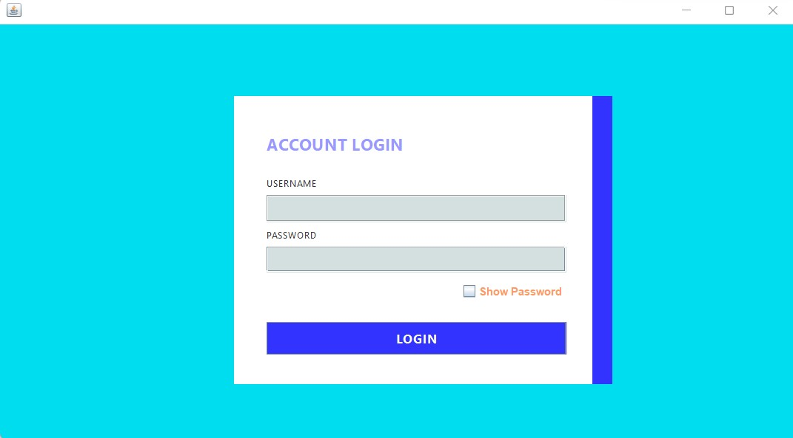
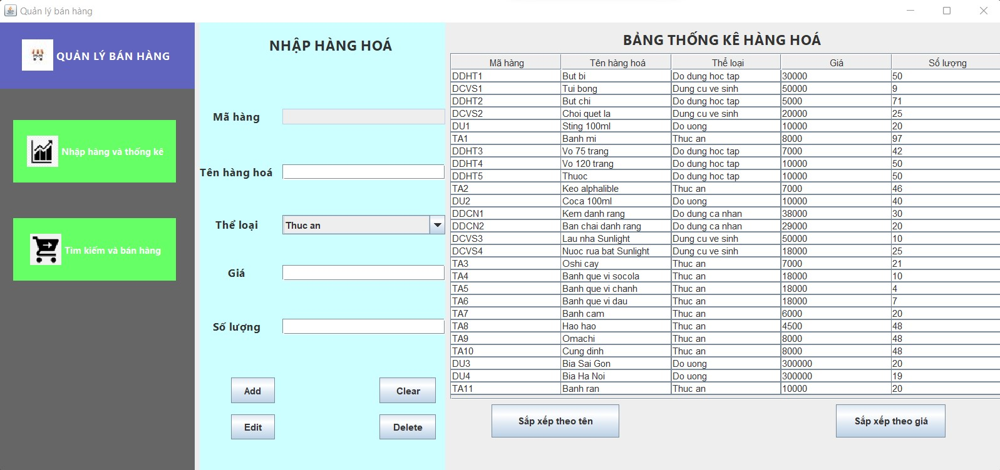

# Quản lý bán hàng trong siêu thị

Đây là chương trình quản lý bán hàng trong siêu thị bằng Java Swing. Chương trình gồm có các tính năng sau:

- Thống kê hàng hoá trong siêu thị.
- Thêm, sửa, xóa hàng hoá.
- Tìm kiếm hàng hoá theo mã hàng hoá hoặc tên hàng hoá.
- In hoá đơn của mỗi khách hàng mua hàng hoá
- Sắp xếp hàng hoá theo tên hoặc theo giá của hàng hoá.
## Yêu cầu:

- Yêu cầu máy phải chạy JDK 20 trở lên.
- Chạy file .jar phải set biến JAVA_HOME thành JDK 20.

## 1. Cài đặt
 - Để chạy chương trình, bạn cần cài đặt Java và Java Swing.
 - Cài đặt `NetBeans 17` và tối thiểu `JDK11` để chạy chương trình.
 
## 2. Các thư mục và tệp tin của dự án
 - `README.md`: tệp chứa thông tin về chương trình và cách chạy chương trình.
 - `product.xml`: tệp tin để lưu trữ và truy xuất dữ liệu. Khi ứng dụng được khởi động, các thông tin được lưu trữ trong file này sẽ được tải vào ứng dụng và sử dụng trong suốt quá trình chạy của ứng dụng.
 - `pom.xml`: tệp tin cấu hình Maven (Maven Project Object Model), chứa thông tin về các thư viện và framework được sử dụng trong dự án, cách đóng gói ứng dụng, các plugin được sử dụng để biên dịch, kiểm tra và triển khai ứng dụng.
 - `lib`: thư mục chứa các **thư viện** (libraries) và file **JAR** (Java Archive) được sử dụng trong dự án, đó các file thực thi, chứa các class, interfaces và các tài nguyên được sử dụng trong dự án.
 - `target`: thư mục chứa tất cả các file được tạo ra bởi quá trình biên dịch và đóng gói, bao gồm các file `.class`, các file `.jar`, các file tài nguyên và các file khác liên quan đến quá trình triển khai ứng dụng. Nó được tự động tạo ra bởi Maven và được sử dụng để triển khai ứng dụng.
 - `src`: chứa 2 thư mục con là `test` và `main`.
 - `test`: thư mục chứa các unit test để kiểm tra tính đúng đắn của mã nguồn trong thư mục `main`. Đây là nơi để viết các test case, đảm bảo rằng các phần của mã nguồn hoạt động đúng và cho phép kiểm tra tính đúng đắn của ứng dụng trong quá trình phát triển.
 - `main`: thư mục chứa mã nguồn chính của ứng dụng để triển khai tính năng và chức năng của ứng dụng.

## 3. Hướng dẫn sử dụng
1. Chạy chương trình bằng cách mở file `demo.java` trong thư mục `test`, click chuột phải và chọn `run file` để khởi chạy chương trình.
2. Nhập tên đăng nhập "`admin`" và mật khẩu "`admin`" để truy cập giao diện chính. Có phần Show Password để xem mật khẩu. Sau khi nhập đúng tên đăng nhập và mật khẩu và click vào button đăng nhập, sẽ hiện ra thông báo đăng nhập thành công

3. Tại đây là cửa sổ giao diện để thực hiện các chức năng của chương trình. 

4. Tại đây ta sẽ thấy một bảng table hiển thị danh sách các hàng hoá trong siêu thị hiện có với dữ liệu được lấy trong file `product.xml`.
5. **Chú ý**: Trường 'Mã hàng' sẽ được tạo tự động. Các trường thông tin `Tên hàng hoá`, `Thể loại`, `Giá`, `Số lượng` được nhập không dấu để tối ưu hóa việc xử lý các chức năng của chương trình, như chức năng thêm, tìm kiếm.

### **1> Chuyển màn hình**
 - Nhập hàng và thống kê: Để thêm, sửa, xoá hàng hoá và thống kê tất cả hàng hoá có trong siêu thị. Muốn tới màn hình có chứa các chức năng này, nhấn vào nút **`Nhập hàng và thống kê`**.

- Tìm kiếm và bán hàng: Để tìm kiếm hàng hoá và thống kê các mặt hàng khách hàng muốn mua, sau đó có thể in bill. Muốn tới màn hình có chứa các chức năng này, nhấn vào nút **`Tìm kiếm và bán hàng`**.

    

### **2> Thêm, sửa, xóa hàng hoá**
 - Thêm hàng hoá: Để thêm hàng hoá mới, bạn chọn thể loại hàng hoá (thuc an, do uong, do dung hoc tap, do dung ca nhan , dung cu ve sinh), điền thông tin vào các trường và nhấn nút **`Thêm`**.
 - Sửa hàng hoá: Để sửa thông tin hàng hoá, bạn chọn hàng hoá cần sửa trong bảng, chỉnh sửa thông tin và nhấn nút **`Sửa`**.
 - Xóa hàng hoá: Để xóa hàng hoá, bạn chọn hàng hoá cần xóa trong danh sách và nhấn nút **`Xóa`**.
 - Click nút **`Làm mới`** để làm mới các trường thông tin.
 - Chú ý:
    + Thể loại không cần phải nhập, bạn có thể chọn 1 trong 5 thể loại hàng hoá trong combo box
    + Việc *thêm* hay *sửa* sẽ tự động chỉnh sửa trường thông tin `Tên hàng hoá`, `Thể loại` theo đúng định dạng (viết hoa và thường) đã được thiết lập trong mã.
    + Trong khi xoá hàng hoá, mã hàng hoá của các sản phẩm cùng thể loại sẽ tự động tăng dần từ 1 tới hết, không bị ngắt quãng
    + *Ngoài ra còn có các xử lý thông báo lỗi khác như nhập thông tin các trường không hợp lệ *

### **3> Sắp xếp hàng hoá**
 - Để sắp xếp hàng hoá theo tên hoặc giá bán, ta chỉ cấn click vào nút sắp xếp tương ứng. Kết quả sẽ được hiển thị trong bảng.

### **4> Tìm kiếm hàng hoá và thêm mặt hàng khách mua**
 1. Chọn tìm kiếm theo `Mã hàng hoá` hoặc theo `Tên hàng hoá` trong combo box     .
 2. Nhập từ khóa tìm kiếm vào ô tìm kiếm và nhấn nút **`Tìm kiếm`** 
 3. Kết quả tìm kiếm sẽ được hiển thị trong bảng 1.
 4. Nếu giá trị tìm kiếm không hợp lệ hoặc không tìm thấy kết quả phù hợp sẽ trả về bảng trống.
 5. Chọn mặt hàng khách mua và tăng giảm số lượng theo nhu cầu của khách hàng và nhấn nút **`Thêm`**, mặt hàng khách mua sẽ xuất hiện ở bảng 2 và trong hoá đơn bên phải.
 6. Nếu chọn 2 mặt hàng giống nhau sẽ tự động tăng số lượng mặt hàng ở bill lên chứ không tạo thêm 1 mặt hàng mới.
 7. Có thể xoá bằng nút **`Xoá`** sau khi chọn một mặt hàng ở bảng 2 theo nhu cầu của khách.
 
 >Chức năng tìm kiếm sẽ tự động chuyển đổi chữ thường và in hoa theo đúng định dạng để bạn không cần phải nhập chính xác từng chữ một (có thể viết thường hay in hoa), giúp tối ưu hóa việc tìm kiếm.

 
### **5> In hoá đơn**
 - Sau khi hoàn thành các thao tác chọn mặt hàng theo yêu cầu của khách và khách muốn tính tiền, in hoá đơn, ta có thể nhấn nút **`Tính tiền`** để tiến hành việc in hoá đơn.
Việc in hoá đơn ở đây sẽ tạo ra 1 file txt theo mẫu "Khách hàng" + STT chứa các thông tin như ngày giờ mua hàng, các mặt hàng đã mua, số lượng, giá tiền của từng mặt hàng đó và tổng tiền của hoá đơn 
 - Việc in hoá đơn này giúp khách hàng có thể kiểm tra lại những sản phẩm đã mua, đem lại độ tin cậy cho khách hàng.

## Tác giả
Chương trình được viết bởi **Ngô Tấn Đạt - B14D52**.
